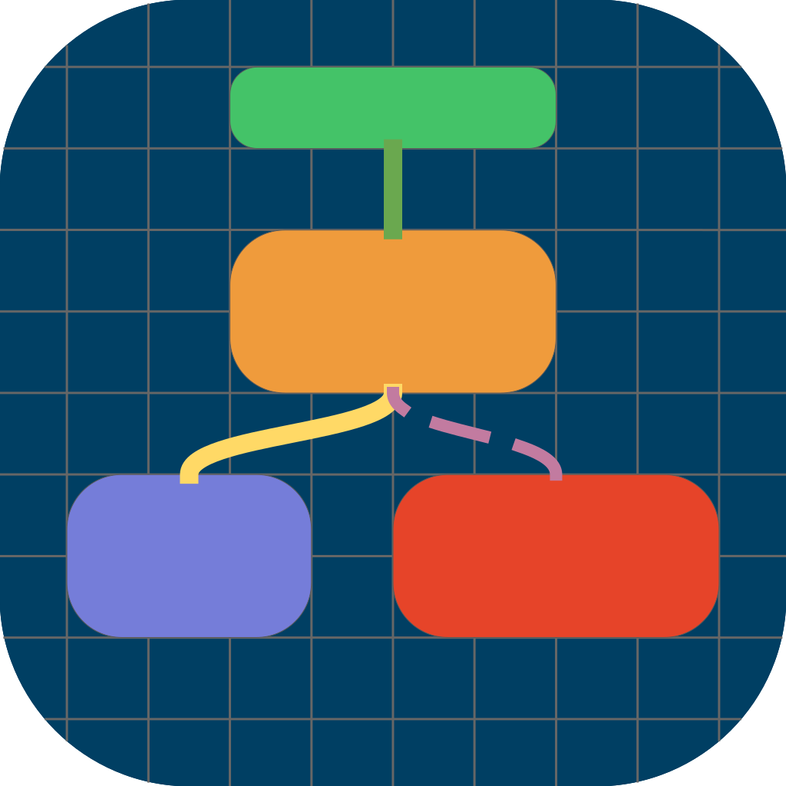
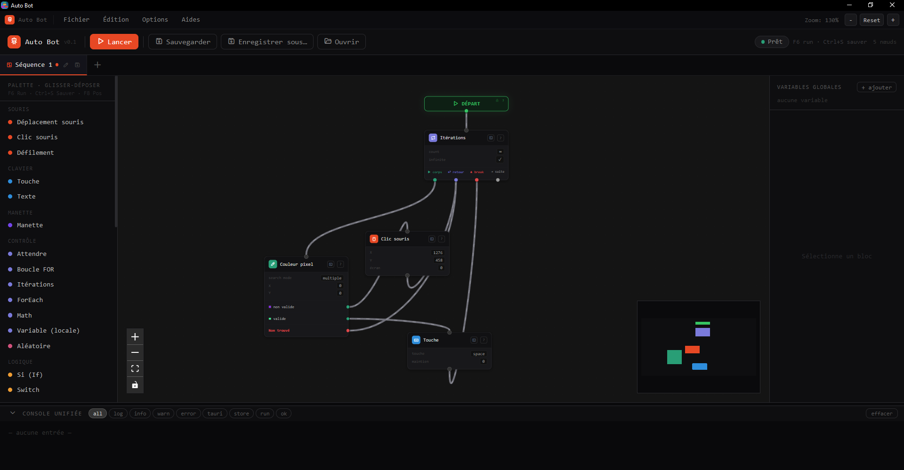
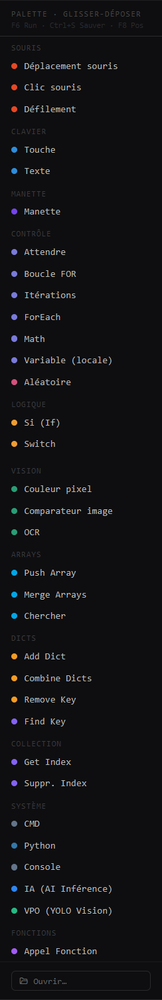

<div align="center">



# Auto-Bot

### Visual desktop automation

Build and execute desktop automation workflows through a visual node-based editor.

<br>

[](https://tauri.app/)
[](https://www.rust-lang.org/)
[](https://react.dev/)
[](https://www.typescriptlang.org/)
[](LICENSE)

</div>

---

## About

**Auto-Bot** is a visual desktop automation application created to solve a personal automation need.

The project allows users to create workflows by connecting visual nodes instead of writing traditional automation scripts.

It combines:

* a visual node-based editor;
* a Rust execution engine;
* native mouse and keyboard automation;
* variables and control flow;
* reusable custom functions;
* screen capture and image analysis.

This repository is published as-is for anyone who may find the project useful.

---

## Features

### Visual workflow editor

Create automation workflows using a node-based editor.

Workflows can contain:

* mouse actions;
* keyboard actions;
* delays;
* variables;
* mathematical operations;
* random values;
* loops;
* conditions;
* image recognition;
* reusable functions.

Multiple workflows and functions can be opened simultaneously through the tab system.

---

### Native desktop automation

The execution engine is written in Rust.

Supported actions include:

* moving the mouse;
* left, right and middle clicks;
* double clicks;
* mouse scrolling;
* keyboard shortcuts;
* text input;
* configurable delays.

---

### Reusable functions

Automation logic can be extracted into reusable custom functions.

Functions can define:

* input arguments;
* internal workflow logic;
* return values.

Functions are stored using the:

```text
.fnc.json
```

format.

---

### Control flow

Auto-Bot supports:

* `FOR` loops;
* conditional execution;
* variable assignment;
* mathematical operations;
* random values;
* function calls.

---

### Screen analysis

The project includes tools for interacting with and analyzing the screen.

Current capabilities include:

* pixel color detection;
* template matching;
* screen capture;
* image processing.

---

## Architecture

```text
┌─────────────────────────────────────────────┐
│              React / TypeScript             │
│                                             │
│  Visual Editor · Nodes · Inspector · Logs   │
│                                             │
└──────────────────────┬──────────────────────┘
                       │
                       │ Tauri IPC
                       ▼
┌─────────────────────────────────────────────┐
│                  Rust Engine                │
│                                             │
│  Workflow Execution · Automation · Vision  │
│  Variables · Functions · System Interaction │
│                                             │
└─────────────────────────────────────────────┘
```

### Frontend

* React
* TypeScript
* XYFlow
* Zustand
* Vite

### Backend

* Rust
* Tauri 2
* Tokio
* Enigo
* XCap
* Image
* ONNX Runtime
* Serde

---

## Project structure

```text
Auto-Bot/
├── src/
│   ├── components/
│   ├── store/
│   ├── types/
│   ├── App.tsx
│   └── main.tsx
│
├── src-tauri/
│   ├── src/
│   │   ├── blocks/
│   │   ├── engine/
│   │   ├── ipc/
│   │   ├── lib.rs
│   │   └── main.rs
│   │
│   ├── Cargo.toml
│   └── tauri.conf.json
│
├── AutoBot.svg
├── package.json
└── README.md
```

---

## Requirements

* Node.js 20+
* npm 10+
* Rust stable
* Tauri 2.x

For Windows development, install:

* [Node.js](https://nodejs.org/)
* [Rustup](https://rustup.rs/)
* Microsoft Visual Studio Build Tools with the C++ desktop development workload.

---

## Installation

```bash
git clone https://github.com/Traycken/Auto-Bot.git
cd Auto-Bot
npm install
```

---

## Development

```bash
npm run tauri dev
```

---

## Production build

```bash
npm run tauri build
```

The generated application packages are placed in:

```text
src-tauri/target/release/bundle/
```

---

## Workflow concepts

### Sequence

A **Sequence** is a complete workflow that can be executed.

A sequence starts from a `START` node and follows the connected execution flow.

---

### Function

A **Function** is a reusable workflow component.

Functions can receive arguments and return values.

Functions are stored as:

```text
.fnc.json
```

---

### Variables

Variables can be used to store and manipulate values throughout a workflow.

Example:

```text
%counter%
%username%
%result%
```

---

## Available blocks

### Mouse

* Move mouse
* Left click
* Right click
* Middle click
* Double click
* Mouse scroll

### Keyboard

* Press a key
* Keyboard shortcuts
* Type text

### Control flow

* Wait
* FOR loop
* Conditional logic
* Function calls

### Variables and calculations

* Set variable
* Mathematical operations
* Random values

### Vision

* Pixel color detection
* Template matching
* Screen capture
* Image processing

---

## Keyboard shortcuts

| Shortcut   | Action                               |
| ---------- | ------------------------------------ |
| `F6`       | Start / stop workflow execution      |
| `F8`       | Capture current mouse position       |
| `Ctrl + S` | Save current workflow                |
| `Ctrl + C` | Copy selected nodes                  |
| `Ctrl + V` | Paste nodes                          |
| `Delete`   | Delete selected nodes or connections |

---

## Project status

This project was created primarily for personal use.

It is published publicly for anyone who may find it useful.

There is no commitment to regular maintenance, support, updates or future development.

If I need to modify the project in the future for my own needs, I may publish those changes when possible.

The project is provided as-is.

---

## Forks and derivatives

You are free to fork this project and create your own version.

However, this project and its derivatives must remain **free and accessible without requiring payment for the software itself**.

If you create a significant fork or derivative project, please consider clearly crediting the original project.

---

## Collaboration

Although this is primarily a personal project, I may be open to welcoming a **principal co-creator**.

This would only be considered for someone who:

* has strong technical skills;
* is genuinely interested in the project;
* understands the existing architecture;
* is willing to contribute meaningfully;
* can bring the project further than I would be willing to do alone.

If you are seriously interested in becoming a principal co-creator, you can contact me through GitHub.

Please do not contact me simply to request basic support or ask me to implement features for you.

---

## Screenshots

<div align="center">



<br><br>



</div>

---

## License

This project is licensed under the [MIT License](LICENSE).

---

<div align="center">

**Auto-Bot**

Created to solve a personal problem.
Published in case it can solve someone else's.

</div>
